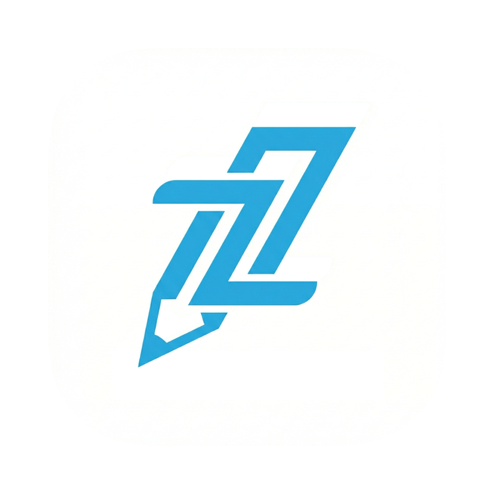
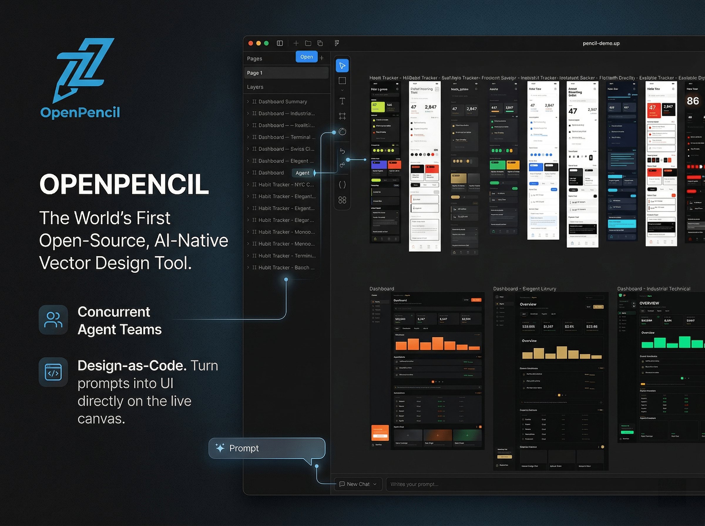

<p align="center">
  
</p>

<h1 align="center">OpenPencil</h1>

<p align="center">
  <strong>世界初のオープンソース AI ネイティブベクターデザインツール。</strong><br />
  <sub>並行エージェントチーム &bull; Design-as-Code &bull; 内蔵 MCP サーバー &bull; マルチモデルインテリジェンス</sub>
</p>

<p align="center">
  <a href="./README.md">English</a> · <a href="./README.zh.md">简体中文</a> · <a href="./README.zh-TW.md">繁體中文</a> · <a href="./README.ja.md"><b>日本語</b></a> · <a href="./README.ko.md">한국어</a> · <a href="./README.fr.md">Français</a> · <a href="./README.es.md">Español</a> · <a href="./README.de.md">Deutsch</a> · <a href="./README.pt.md">Português</a> · <a href="./README.ru.md">Русский</a> · <a href="./README.hi.md">हिन्दी</a> · <a href="./README.tr.md">Türkçe</a> · <a href="./README.th.md">ไทย</a> · <a href="./README.vi.md">Tiếng Việt</a> · <a href="./README.id.md">Bahasa Indonesia</a>
</p>

<p align="center">
  <a href="https://github.com/ZSeven-W/openpencil/stargazers"></a>
  <a href="https://github.com/ZSeven-W/openpencil/blob/main/LICENSE"></a>
  <a href="https://github.com/ZSeven-W/openpencil/actions/workflows/ci.yml"></a>
  <a href="https://discord.gg/h9Fmyy6pVh"></a>
</p>

<br />

<p align="center">
  <a href="https://oss.ioa.tech/zseven/openpencil/a46e24733239ce24de36702342201033.mp4">
    
  </a>
</p>
<p align="center"><sub>画像をクリックしてデモ動画を視聴</sub></p>

<br />

> **注：** 同名の別のオープンソースプロジェクト — [OpenPencil](https://github.com/open-pencil/open-pencil) があります。そちらは Figma 互換のビジュアルデザインとリアルタイムコラボレーションに特化しています。本プロジェクトは AI ネイティブのデザインからコードへのワークフローに特化しています。

## Why OpenPencil

<table>
<tr>
<td width="50%">

### 🎨 プロンプト → キャンバス

自然言語で任意の UI を記述。ストリーミングアニメーションでリアルタイムに無限キャンバス上に表示。要素を選択してチャットすることで既存のデザインを修正。

</td>
<td width="50%">

### 🤖 並行エージェントチーム

オーケストレーターが複雑なページを空間的なサブタスクに分解。複数の AI エージェントがヒーロー、機能紹介、フッターなど異なるセクションを同時に処理し、すべてが並列でストリーミング。

</td>
</tr>
<tr>
<td width="50%">

### 🧠 マルチモデルインテリジェンス

各モデルの能力に自動適応。Claude にはシンキング付きフルプロンプト、GPT-4o/Gemini ではシンキングを無効化、小規模モデル（MiniMax、Qwen、Llama）には信頼性の高い出力のために簡略化プロンプトを使用。

</td>
<td width="50%">

### 🔌 MCP サーバー

Claude Code、Codex、Gemini、OpenCode、Kiro、Copilot CLI にワンクリックでインストール。ターミナルからデザイン — MCP 対応エージェントを通じて `.op` ファイルの読み取り、作成、編集が可能。

</td>
</tr>
<tr>
<td width="50%">

### 📦 Design-as-Code

`.op` ファイルは JSON — 人間が読みやすく、Git フレンドリーで差分比較可能。デザイン変数は CSS カスタムプロパティを生成。React + Tailwind または HTML + CSS へのコードエクスポート。

</td>
<td width="50%">

### 🖥️ どこでも動作

Web アプリ + Electron による macOS・Windows・Linux ネイティブデスクトップ。GitHub Releases からの自動アップデート。`.op` ファイル関連付け — ダブルクリックで開く。

</td>
</tr>
<tr>
<td width="50%">

### ⌨️ CLI — `op`

ターミナルからデザインツールを操作。`op design`、`op insert` — バッチデザインDSL、ノード操作。ファイルやstdinからのパイプ入力に対応。デスクトップアプリまたはWebサーバーと連携。

</td>
<td width="50%">

### 🎯 マルチプラットフォームコードエクスポート

1つの`.op`ファイルからReact + Tailwind、HTML + CSS、Vue、Svelte、Flutter、SwiftUI、Jetpack Compose、React Nativeへエクスポート。デザイン変数はCSSカスタムプロパティに変換。

</td>
</tr>
</table>

## クイックスタート

```bash
# Web dev server (builds the CanvasKit wasm bundle, then runs the headless web host)
bash scripts/start-web-rust.sh
```

またはデスクトップアプリとして実行：

```bash
cargo run -p op-host-desktop
```

> **前提条件：** 製品のビルドには [Rust](https://www.rust-lang.org/)（stable）が必要です。[Bun](https://bun.sh/) >= 1.0 および [Node.js](https://nodejs.org/) >= 18 は `packages/` 配下の web SDK にのみ必要です。

### Docker

複数のイメージバリアントが利用可能です — ニーズに合ったものを選択してください：

| イメージ                     | サイズ  | 含まれるもの         |
| ---------------------------- | ------- | -------------------- |
| `openpencil:latest`          | ~226 MB | Web アプリのみ       |
| `openpencil-claude:latest`   | —       | + Claude Code CLI    |
| `openpencil-codex:latest`    | —       | + Codex CLI          |
| `openpencil-opencode:latest` | —       | + OpenCode CLI       |
| `openpencil-copilot:latest`  | —       | + GitHub Copilot CLI |
| `openpencil-gemini:latest`   | —       | + Gemini CLI         |
| `openpencil-full:latest`     | ~1 GB   | すべての CLI ツール  |

**実行（Web のみ）：**

```bash
docker run -d -p 3000:3000 ghcr.io/zseven-w/openpencil:latest
```

**AI CLI 付きで実行（例：Claude Code）：**

AI チャットは Claude CLI OAuth ログインに依存しています。Docker ボリュームを使用してログインセッションを永続化してください：

```bash
# ステップ 1 — ログイン（初回のみ）
docker volume create openpencil-claude-auth
docker run -it --rm \
  -v openpencil-claude-auth:/root/.claude \
  ghcr.io/zseven-w/openpencil-claude:latest claude login

# ステップ 2 — 起動
docker run -d -p 3000:3000 \
  -v openpencil-claude-auth:/root/.claude \
  ghcr.io/zseven-w/openpencil-claude:latest
```

**ローカルビルド：**

```bash
# ベース（Web のみ）
docker build --target base -t openpencil .

# 特定の CLI 付き
docker build --target with-claude -t openpencil-claude .

# フル（すべての CLI）
docker build --target full -t openpencil-full .
```

## AI ネイティブデザイン

**プロンプトから UI へ**

- **テキストからデザインへ** — ページを説明すると、ストリーミングアニメーションでリアルタイムにキャンバス上に生成
- **オーケストレーター** — 複雑なページを空間サブタスクに分解し、並列生成をサポート
- **デザイン修正** — 要素を選択し、自然言語で変更内容を記述
- **ビジョン入力** — スクリーンショットやモックアップを参照として添付してデザイン

**マルチエージェントサポート**

| エージェント                      | 設定方法                                                                                          |
| --------------------------------- | ------------------------------------------------------------------------------------------------- |
| **ビルトイン（9+ プロバイダー）** | プロバイダープリセットから選択し、リージョンを切り替え — Anthropic、OpenAI、Google、DeepSeek など |
| **Claude Code**                   | 設定不要 — ローカル OAuth で Claude Agent SDK を使用                                              |
| **Codex CLI**                     | エージェント設定で接続（`Cmd+,`）                                                                 |
| **OpenCode**                      | エージェント設定で接続（`Cmd+,`）                                                                 |
| **GitHub Copilot**                | `copilot login` 後、エージェント設定で接続（`Cmd+,`）                                             |
| **Gemini CLI**                    | エージェント設定で接続（`Cmd+,`）                                                                 |

**モデル能力プロファイル** — モデルの階層に応じてプロンプト、シンキングモード、タイムアウトを自動適応。フル階層モデル（Claude）には完全なプロンプト、標準階層（GPT-4o、Gemini、DeepSeek）ではシンキングを無効化、ベーシック階層（MiniMax、Qwen、Llama、Mistral）には最大限の信頼性のために簡略化されたネスト JSON プロンプトを使用。

**i18n** — 15言語での完全なインターフェースローカライゼーション：English、简体中文、繁體中文、日本語、한국어、Français、Español、Deutsch、Português、Русский、हिन्दी、Türkçe、ไทย、Tiếng Việt、Bahasa Indonesia。

**MCP サーバー**

- 内蔵 MCP サーバー — Claude Code / Codex / Gemini / OpenCode / Kiro / Copilot CLI にワンクリックでインストール
- Node.js を自動検出 — 未インストールの場合は HTTP トランスポートに自動フォールバックし、MCP HTTP サーバーを自動起動
- ターミナルからのデザイン自動化：MCP 対応エージェントを通じて `.op` ファイルの読み取り、作成、編集が可能
- **レイヤードデザインワークフロー** — `design_skeleton` → `design_content` → `design_refine` による高忠実度マルチセクションデザイン
- **セグメント化プロンプト取得** — 必要なデザイン知識のみをロード（schema、layout、roles、icons、planning など）
- マルチページサポート — MCP ツールを通じてページの作成、名前変更、並べ替え、複製が可能

**コード生成**

- React + Tailwind CSS、HTML + CSS、CSS Variables
- Vue、Svelte、Flutter、SwiftUI、Jetpack Compose、React Native

## CLI — `op`

グローバルインストールしてターミナルからデザインツールを操作：

```bash
brew install zseven-w/openpencil/op
```

```bash
op start                     # デスクトップアプリを起動
op design @landing.txt       # ファイルからバッチデザイン
op insert '{"type":"RECT"}'  # ノードを挿入
op import:figma design.fig   # Figma ファイルをインポート
cat design.dsl | op design - # stdin からパイプ入力
```

3つの入力方法に対応：インライン文字列、`@filepath`（ファイルから読み込み）、`-`（stdin から読み込み）。デスクトップアプリまたは Web 開発サーバーと連携。完全なコマンドリファレンスは [CLI README](./crates/op-cli) を参照。

**LLM スキル** — [OpenPencil Skill](https://github.com/ZSeven-W/openpencil-skill) プラグインをインストールすると、AIエージェント（Claude Code、Cursor、Codex、Gemini CLI など）に `op` を使ったデザインを教えられます。

## 機能

**キャンバスと描画**

- パン、ズーム、スマートアライメントガイド、スナッピング対応の無限キャンバス
- 矩形、楕円、直線、多角形、ペン（ベジェ）、Frame、テキスト
- ブーリアン演算 — 合体、型抜き、交差（コンテキストツールバー付き）
- アイコンピッカー（Iconify）と画像インポート（PNG/JPEG/SVG/WebP/GIF）
- オートレイアウト — 垂直/水平方向、ギャップ・パディング・justify・align 対応
- タブナビゲーション付きマルチページドキュメント

**デザインシステム**

- デザイン変数 — カラー・数値・文字列トークン、`$variable` 参照付き
- マルチテーマサポート — 複数のテーマ軸、各軸に複数バリアント（Light/Dark、Compact/Comfortable）
- コンポーネントシステム — インスタンスとオーバーライドを持つ再利用可能なコンポーネント
- CSS 同期 — カスタムプロパティの自動生成、コード出力に `var(--name)` を使用
- 再利用可能な UIKit — `.pen` ファイルからコンポーネントキットをインポート/エクスポート

**AI とエージェント**

- ストリーミング生成とオーケストレーター駆動の空間分解によるプロンプトからキャンバスへの変換
- 並行エージェントチーム — 複数のデザイナーが異なるセクションを並列で処理し、各メンバーにキャンバスインジケーター
- レイヤードワークフロー — `design_skeleton` → `design_content` → `design_refine`、各フェーズごとに焦点を絞ったプロンプト
- スタイルガイド — 50+ のビルトインスタイル（glassmorphism、brutalist、retro など）、タグベースのファジーマッチング対応、プランニングと生成に統合
- マルチモデル能力プロファイル — モデル階層に応じてシンキングモード、エフォート、プロンプト形状を自動適応
- ビルトインエージェントランタイム（Rust）+ Anthropic、Claude Agent SDK、OpenCode、Codex、Copilot、Gemini プロバイダー
- 中国系 LLM プロバイダー向け Anthropic フォーマットパススルー — Kimi、Zhipu、GLM、DouBao、Ark、Bailian/DashScope、ModelScope、Coding Plans

**Git 統合**

- SSH / HTTPS 認証と SSH キー管理を備えたクローンウィザード
- ブランチピッカー — 作成、切り替え、削除、マージをすべて Git パネルから
- プル / プッシュカスケード — 認証リトライとノンファストフォワード処理対応
- フォルダーモード三方向マージ — ディスク上の `MERGE_HEAD` 状態追跡付き
- コンフリクトパネル — ノード/フィールド単位の三方向カード、インライン JSON エディター、一括操作、インライン diff ブロック
- リモート設定と SSH キー UI、Git サーフェス全体にわたる 15 ロケール i18n

**エクスポート**

- キャンバスエクスポート — PNG、JPEG、WEBP、PDF（`Cmd+Shift+P`）
- コードエクスポート — React + Tailwind、HTML + CSS、Vue、Svelte、Flutter、SwiftUI、Jetpack Compose、React Native
- インクリメンタル MCP コード生成パイプライン — `codegen_plan`、`codegen_submit_chunk`、`codegen_assemble`、`codegen_clean`

**Figma インポート**

- レイアウト、フィル、ストローク、エフェクト、テキスト、画像、ベクターを保持して `.fig` ファイルをインポート

**デスクトップアプリ**

- Electron によるネイティブ macOS・Windows・Linux 対応
- `.op` ファイル関連付け — ダブルクリックで開く、シングルインスタンスロック
- GitHub Releases からの自動アップデート
- 名前を付けて保存、最近使った項目を開く、および終了時の未保存変更ダイアログを備えたネイティブアプリケーションメニュー
- 最近使ったファイルの永続化

## 技術スタック

|                    |                                                                                  |
| ------------------ | -------------------------------------------------------------------------------- |
| **フロントエンド** | React 19 · TanStack Start · Tailwind CSS v4 · shadcn/ui · i18next                |
| **キャンバス**     | CanvasKit/Skia（WASM、GPU アクセラレーション）                                   |
| **状態管理**       | Zustand v5                                                                       |
| **サーバー**       | Nitro                                                                            |
| **デスクトップ**   | Electron 35                                                                      |
| **CLI**            | `op` — ターミナル制御、バッチデザインDSL                                         |
| **AI**             | Vercel AI SDK v6 · Anthropic SDK · Claude Agent SDK · OpenCode SDK · Copilot SDK |
| **ランタイム**     | Bun · Vite 7                                                                     |
| **ファイル形式**   | `.op` — JSON ベース、人間が読みやすく、Git フレンドリー                          |

## なぜ Rust か

OpenPencil は **Rust** で一から書き直されています ([#129](https://github.com/ZSeven-W/openpencil/issues/129))。現在リリースされているのは TypeScript + Electron ビルドです。Rust による書き直しがその次のステップ — ひとつのネイティブコアで劇的に軽量かつ高速になり、単一のコードベースからより多くのプラットフォームで動作します。

|                       | TypeScript + Electron（今日）                  | Rust（書き直し後）                                                  |
| --------------------- | ---------------------------------------------- | ------------------------------------------------------------------- |
| **デスクトップランタイム** | Electron — Chromium + Node.js をバンドル       | ネイティブウィンドウ（`winit` + GPU Skia）、ブラウザエンジン不要     |
| **デスクトップフットプリント** | インストールごとに Chromium ランタイム全体     | 単一の自己完結型バイナリ — **55.5 MB**                              |
| **Web ペイロード**    | JS + WASM バンドル                             | **8.2 MB** wasm / **2.18 MB** gzip（転送時）                        |
| **レンダリング**      | Web 上の CanvasKit/Skia                        | **すべての**ターゲットで単一の GPU アクセラレーション Skia バックエンド |
| **メモリ**            | JavaScript GC によるポーズ                     | GC なし — Rust 所有権モデル、予測可能なレイテンシ                   |
| **コードベース**      | Web スタック + Electron | 単一 Rust ワークスペース：エディター・CLI・MCP・AI・codegen・Figma・Git |
| **ターゲット**        | Web + デスクトップ、別々のスタック             | デスクトップ（macOS/Win/Linux）・モバイル（iOS/Android）・ブラウザ — 単一コア |

**実測改善値**

- **極小フットプリント** — デスクトップアプリ全体が、ブラウザエンジンと Node ランタイムのバンドルではなく、**55.5 MB** のネイティブバイナリ 1 つ。Web ビルドはアイコンカタログを分割した後、**8.2 MB** 生 / **2.18 MB** gzip（転送量 −48%）。
- **大規模ドキュメントへのスケール** — **10,000-node** のライブキャンバス（ネスト 4 段のオートレイアウト）で、書き込み・読み込み・レイアウトスナップショットを**パニックなし、アイドル CPU ~0%** で実行。全 10k ノードのレイアウトスナップショットは **~0.68 s** で返却。
- **高速インタラクション** — パン/ズームがフレームごとにドキュメントを再シリアライズしなくなった（ホットパスの修正 1 点でホイールズーム CPU を **~69% から ~0%** に削減）。ドラッグはシーンをインクリメンタルにパッチし、テキスト計測はキャッシュされ、再描画は 1 フレームあたり 1 回にまとめられる。
- **単一コア、あらゆる画面** — 同じエディターステートと同じレンダリングバックエンドが、WASM 経由でネイティブデスクトップ、モバイル、ブラウザにコンパイル — 同期を保つための並列再実装は不要。
- **GPU Skia everywhere** — ネイティブは GL コンテキスト上の `skia-safe` でレンダリング。ブラウザは WebGL2 上の CanvasKit でレンダリング — 同じ描画コード、同じ出力。
- **ネイティブアクセシビリティ** — macOS・Windows・Linux では AccessKit を使用し、Web ではブラウザの a11y ツリーに依存する代わりに DOM ミラーを提供。
- **型チェック済みの単一ワークスペース** — MCP ホスト、CLI、AI プロバイダー、コード生成、Figma インポート、Git 統合がすべて単一の Rust ワークスペースに収まり、CI では `cargo-deny` によるサプライチェーンのゲーティングを実施。

> **ステータス：** Rust シェルは現在活発に開発中です（下記のロードマップを参照）。`v0.8.0` の機能同等性に達するまで、上記のインストーラブルダウンロードは TypeScript + Electron ビルドです。

## プロジェクト構成

```text
openpencil/
├── apps/
│   ├── web/                 TanStack Start Web アプリ
│   │   ├── src/
│   │   │   ├── canvas/      CanvasKit/Skia エンジン — 描画、同期、レイアウト
│   │   │   ├── components/  React UI — エディター、パネル、共有ダイアログ、アイコン
│   │   │   ├── services/ai/ AI チャット、オーケストレーター、デザイン生成、ストリーミング
│   │   │   ├── stores/      Zustand — キャンバス、ドキュメント、ページ、履歴、AI
│   │   │   ├── mcp/         外部 CLI 統合用 MCP サーバーツール
│   │   │   ├── hooks/       キーボードショートカット、ファイルドロップ、Figma ペースト
│   │   │   └── uikit/       再利用可能なコンポーネントキットシステム
│   │   └── server/
│   │       ├── api/ai/      Nitro API — ストリーミングチャット、生成、バリデーション
│   │       └── utils/       Claude CLI、OpenCode、Codex、Copilot ラッパー
│   ├── desktop/             Electron デスクトップアプリ
│   │   ├── main.ts          ウィンドウ、Nitro フォーク、ネイティブメニュー、自動アップデーター
│   │   ├── ipc-handlers.ts  ネイティブファイルダイアログ、テーマ同期、設定 IPC
│   │   └── preload.ts       IPC ブリッジ
│   └── cli/                 CLIツール — `op` コマンド
│       ├── src/commands/    デザイン、ドキュメント、エクスポート、インポート、ノード、ページ、変数コマンド
│       ├── connection.ts    実行中アプリへのWebSocket接続
│       └── launcher.ts      デスクトップアプリまたはWebサーバーの自動検出・起動
├── packages/
│   ├── pen-types/           PenDocument モデルの型定義
│   ├── pen-core/            ドキュメントツリー操作、レイアウトエンジン、変数
│   ├── pen-codegen/         コードジェネレーター（React、HTML、Vue、Flutter、...）
│   ├── pen-figma/           Figma .fig ファイルパーサーとコンバーター
│   ├── pen-renderer/        スタンドアロン CanvasKit/Skia レンダラー
│   ├── pen-sdk/             アンブレラ SDK（全パッケージの再エクスポート）
│   ├── pen-ai-skills/       AI プロンプトスキルエンジン（フェーズ駆動プロンプト読込）
│   └── agent/               AI エージェント SDK（Vercel AI SDK、マルチプロバイダー、エージェントチーム）
└── .githooks/               ブランチ名からのプレコミットバージョン同期
```

## キーボードショートカット

| キー        | 操作           |     | キー          | 操作                            |
| ----------- | -------------- | --- | ------------- | ------------------------------- |
| `V`         | 選択           |     | `Cmd+S`       | 保存                            |
| `R`         | 矩形           |     | `Cmd+Z`       | 元に戻す                        |
| `O`         | 楕円           |     | `Cmd+Shift+Z` | やり直す                        |
| `L`         | 直線           |     | `Cmd+C/X/V/D` | コピー/カット/ペースト/複製     |
| `T`         | テキスト       |     | `Cmd+G`       | グループ化                      |
| `F`         | Frame          |     | `Cmd+Shift+G` | グループ解除                    |
| `P`         | ペンツール     |     | `Cmd+Shift+P` | エクスポート (PNG/JPG/WEBP/PDF) |
| `H`         | ハンド（パン） |     | `Cmd+Shift+C` | コードパネル                    |
| `Del`       | 削除           |     | `Cmd+Shift+V` | 変数パネル                      |
| `[ / ]`     | 重ね順の変更   |     | `Cmd+J`       | AI チャット                     |
| 矢印キー    | 1px 微調整     |     | `Cmd+,`       | エージェント設定                |
| `Cmd+Alt+U` | ブーリアン合体 |     | `Cmd+Alt+S`   | ブーリアン型抜き                |
| `Cmd+Alt+I` | ブーリアン交差 |     | `Cmd+Shift+S` | 名前を付けて保存                |

## スクリプト

```bash
# Product (Rust — run from the repo root)
cargo build --workspace              # Build all crates (add --release for prod)
cargo test --workspace               # Run all tests
cargo check --workspace              # Type check
cargo clippy --workspace --all-targets -- -D warnings   # Lint
cargo fmt --all                      # Format
bash scripts/start-web-rust.sh       # Web dev server (wasm bundle + headless host)
cargo run -p op-host-desktop         # Desktop app (binary: openpencil-desktop)
cargo run -p op-cli -- <args>        # CLI (binary: op)

# Web SDK / JS tooling (run from packages/)
cd packages && bun run lint          # Lint the web SDK (oxlint); also: bun run format
cd packages && bun run generate-iconify-catalog   # Regenerate the Rust icon catalog assets
cd packages && bun run bump <version>             # Sync SDK package.json versions
```

## コントリビュート

コントリビューションを歓迎します！アーキテクチャの詳細とコードスタイルについては [CLAUDE.md](./CLAUDE.md) をご覧ください。

1. フォークしてクローン
2. バージョン同期を設定：`git config core.hooksPath .githooks`
3. ブランチを作成：`git checkout -b feat/my-feature`
4. チェックを実行：`cargo test --workspace && cargo clippy --workspace --all-targets -- -D warnings`
5. [Conventional Commits](https://www.conventionalcommits.org/) 形式でコミット：`feat(canvas): add rotation snapping`
6. `main` ブランチに PR を作成

## ロードマップ

- [x] CSS 同期付きデザイン変数とトークン
- [x] コンポーネントシステム（インスタンスとオーバーライド）
- [x] オーケストレーター付き AI デザイン生成
- [x] レイヤードデザインワークフロー付き MCP サーバー統合
- [x] マルチページサポート
- [x] Figma `.fig` インポート
- [x] ブーリアン演算（合体、型抜き、交差）
- [x] マルチモデル能力プロファイル
- [x] 再利用可能なパッケージによるモノレポ構成
- [x] CLIツール（`op`）ターミナル制御
- [x] ビルトイン AI エージェント SDK（マルチプロバイダー対応）
- [x] i18n — 15言語対応
- [x] Git 統合（クローン、ブランチ、プッシュ/プル、フォルダーモード三方向マージ）
- [x] キャンバスのラスターエクスポート（PNG / JPEG / WEBP / PDF）
- [ ] 共同編集
- [ ] プラグインシステム

## コントリビューター

<a href="https://github.com/ZSeven-W/openpencil/graphs/contributors">
  
</a>

## スポンサー

OpenPencil は無料でオープンソースです。開発は、これを便利だと感じてくださる皆さんの支援で成り立っています — キャンバスを開いたままにしてくれてありがとう。

<a href="https://github.com/mrqyun" title="MrQyun">
  
</a>

**[MrQyun](https://github.com/mrqyun)** さん、ありがとうございます — あなたの名前もここに並べませんか？**[スポンサーになる →](https://github.com/sponsors/ZSeven-W)**

## コミュニティ

<a href="https://discord.gg/h9Fmyy6pVh">
  
  <strong> Discord に参加する</strong>
</a>
— 質問、デザインの共有、機能のリクエストはこちら。

## Star History

<a href="https://star-history.com/#ZSeven-W/openpencil&Date">
 <picture>
   <source media="(prefers-color-scheme: dark)" srcset="https://api.star-history.com/svg?repos=ZSeven-W/openpencil&type=Date&theme=dark" />
   <source media="(prefers-color-scheme: light)" srcset="https://api.star-history.com/svg?repos=ZSeven-W/openpencil&type=Date" />
   
 </picture>
</a>

## セキュリティ評価

[](https://mseep.ai/app/zseven-w-openpencil)

## ライセンス

[MIT](./LICENSE) — Copyright (c) 2026 ZSeven-W
