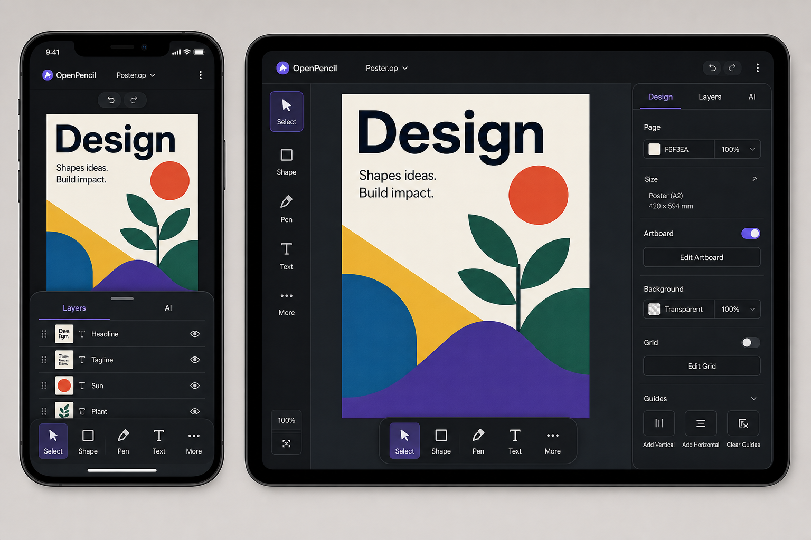
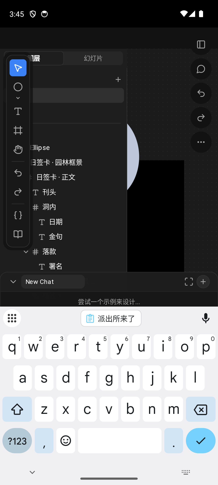
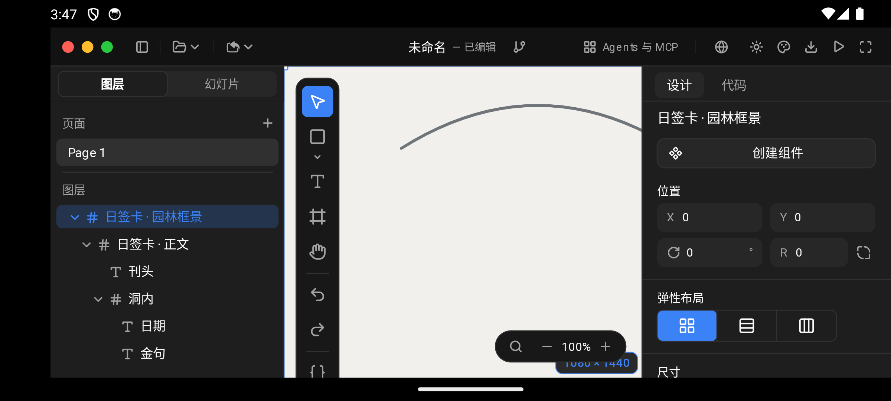

# OpenPencil Mobile and Tablet Editor Redesign Handoff

Status: implementation brief
Audience: implementation agent working in `/Users/kayshen/Workspace/ZSeven-W/openpencil`
Scope: iOS and Android full-editor mode; shared Rust editor UI; phone, tablet, rotation, and split-window responsiveness

## Goal

Replace the current scaled-down desktop chrome with a canvas-first, touch-first editor that feels native on phones and tablets while preserving the existing OpenPencil visual language and editor behavior.

The final UI must:

- adapt live when the viewport changes, without recreating the engine;
- work in phone portrait, phone landscape, tablet portrait, tablet landscape, and split-window widths;
- use shared Rust widgets and geometry for visual editor chrome;
- keep Swift/Kotlin limited to lifecycle, surface, safe area, keyboard/IME, touches, and frame scheduling;
- preserve document editing, layers, properties, AI chat, undo/redo, page switching, and all existing input bridges.

## Visual reference

Use this direction board for hierarchy and proportions, not as a pixel-exact specification:



The reference was generated with the built-in image generation workflow. Important ideas to keep:

- phone: canvas-first, compact app bar, bottom thumb toolbar, panels as bottom sheets;
- tablet: compact app bar, one narrow persistent rail where space allows, contextual inspector on the opposite side only when the canvas remains usable;
- controls are large, calm, and grouped by task;
- no desktop menu bar, tiny icon grid, or five-button vertical action stack on phones.

Do not copy generated microcopy, artwork, or device bezels literally.

## Current-state evidence

The current Android build can paint Layers, the full desktop toolbar, the right-side action cluster, AI chat, and the keyboard simultaneously. The result leaves almost no usable canvas, lets the toolbar overlap layer content, and places the chat composer behind the IME:



Treat this screenshot as a problem statement, not a visual reference. The new overlay controller must make these surfaces mutually exclusive and must lay out against the keyboard-adjusted usable rectangle.

A fresh launch of the same phone in landscape crosses the current one-time 768pt width check and receives the full desktop chrome, including desktop window controls and both fixed rails:



This proves why width alone is insufficient and why the class must be recomputed from both usable width and height on every resize.

## Product principles

1. The artwork is primary. Chrome should not permanently consume most of a phone screen.
2. Frequent actions belong in the thumb zone. Rare actions belong in sheets or overflow.
3. A phone is not a narrow desktop. It has one primary surface and one transient secondary surface.
4. A tablet uses additional width progressively. It must not jump directly to the full desktop two-rail layout at one breakpoint.
5. Paint geometry and hit-test geometry must come from the same functions.
6. Touch must never depend on hover, right-click, or sub-44-point targets.
7. Safe areas and the software keyboard are layout inputs, not merely values stored by the shell.

## Responsive model

Replace the current one-time `mobile_layout: bool` decision with a live size class. The exact type name is flexible; keep it in `op-editor-core` and keep layout geometry in `op-editor-ui`.

Recommended size classes:

| Class | Suggested rule | Intended layouts |
| --- | --- | --- |
| Compact | width `< 600pt`, or height `< 500pt` | phones, phone landscape, narrow split-window |
| Medium | width `600–959pt` | tablet portrait, large foldables, medium split-window |
| Expanded | width `>= 960pt` and height `>= 600pt` | tablet landscape and large tablets |

Rules are based on the usable content rectangle after safe-area and keyboard occlusion. Height can force a downgrade. Do not infer touch versus pointer from width; input density should be a separate concern.

The layout class must be recomputed on every create and resize. A running Android app changing from 767dp to 768dp, an iPad entering split view, and a phone rotating must reflow immediately without losing document or editor state.

### Visibility by size class

| Surface | Compact | Medium | Expanded |
| --- | --- | --- | --- |
| App bar | compact | compact | compact |
| Primary tool dock | bottom | bottom or narrow left rail, chosen by available height | bottom-centered or narrow left rail |
| Layers | modal bottom sheet | one overlay side sheet; may persist if canvas stays `>= 480pt` | persistent left rail allowed |
| Properties | modal bottom sheet | overlay side sheet or bottom sheet | persistent right inspector only if canvas stays `>= 560pt` |
| AI chat | modal bottom sheet | overlay sheet | overlay right sheet; never a freely draggable desktop window in touch mode |
| Undo/redo | app bar | app bar | app bar |
| Status/zoom | compact pill; hide nonessential text | compact pill | compact pill |
| Page switcher | shared themed compact pill | shared themed compact pill | shared themed compact pill |

Only one modal sheet is open at a time on Compact and Medium. Opening Layers closes AI and other modal surfaces. Selecting an object may open the property sheet only when explicitly requested; selection alone must not cover nearly half the phone canvas unexpectedly.

## Phone layout

### App bar

- Height: `52pt` plus top safe area.
- Left: OpenPencil mark or back/document control.
- Center: truncated document title.
- Right: undo, redo, overflow. Each hit target is at least `44×44pt`.
- No desktop File/Edit-style menus. Map required commands into overflow sheets.
- The app bar is part of the shared Rust editor chrome so iOS and Android stay visually and behaviorally aligned.

### Canvas

- Fills the width between the app bar and bottom dock.
- Must not retain the current empty 40pt desktop-top-bar offset when the desktop `TopBar` is hidden.
- Two-finger pan and pinch remain available.
- One-finger editing behavior already present in the mobile shell must be preserved.
- A transient sheet may overlay the canvas with a dim scrim; it must not permanently resize the phone canvas.

### Bottom tool dock

- Height: `56pt` plus bottom safe area.
- Main targets: Select, Shape, Pen, Text, More.
- Each target: preferably `48pt`, never below `44pt`; icon around `20pt`.
- Shape opens a touch-sized shape picker sheet or anchored palette.
- More contains Frame, Hand, Variables, Design System, and other lower-frequency tools/actions.
- Active tool gets the existing semantic primary color. Do not hardcode a dark `#121212` background; use theme tokens.
- Phone landscape uses the same compact dock but may omit labels. It must not fall back to the 362pt desktop vertical toolbar.

### Sheets

- Bottom sheets have top radii `20pt`, a centered drag handle, a clear title, and a `44×44pt` close target.
- Default heights should be content-aware with approximately 45%, 70%, and full-height detents. If implementing gestures is out of scope for the first pass, use a deterministic 65–72% height with an explicit expand action.
- The sheet body must stop above the keyboard. AI input and text/property editing must remain visible when IME is open.
- Sheet content uses touch density: `44pt` minimum rows, `15pt` body text, `17pt` titles.
- Avoid dense desktop multi-column property rows. Stack label and control when the remaining width is too small.

### Sheet information architecture

- Layers: Pages/Slides and Layers as top tabs; large rows; visibility/lock controls at least 44pt; drag handles only when reordering is enabled.
- Properties: concise contextual sections first (position/size, fill, typography); advanced sections collapsed.
- AI: chat transcript, model selector, and composer; remove desktop window drag/resize/maximize affordances in touch mode.
- More: document actions, settings, variables, design system, preview, export.

## Tablet layout

### Medium tablet

- Keep the compact app bar.
- Permit only one persistent side surface at a time.
- Prefer a `240–280pt` Layers rail when it leaves at least `480pt` of canvas.
- Properties and AI appear as mutually exclusive overlay sheets/cards from the trailing edge or bottom, depending on orientation.
- In portrait, bottom dock is preferred. In a short landscape split, use the Compact fallback.

### Expanded tablet

- Compact app bar across the top.
- Persistent narrow Layers rail is allowed.
- A contextual right inspector (`280–320pt`) is allowed only when the remaining canvas is at least `560pt` wide.
- If that guarantee fails, inspector becomes an overlay sheet without changing the document or selection.
- Primary tools may use a bottom-centered dock or a narrow left icon rail. Pick one geometry per size class; do not paint both.
- AI remains an overlay sheet/card and should never obscure both the canvas and inspector simultaneously.

## Design tokens

Preserve and reuse:

- semantic colors from `crates/op-editor-ui/src/theme.rs`;
- Lucide paths from `crates/op-editor-ui/src/widgets/icons.rs`;
- `system-ui` and real text measurement from `text_metrics.rs`;
- jian component tokens and `Density::Touch`.

Recommended mobile tokens:

| Token | Value |
| --- | --- |
| Minimum touch target | `44pt` |
| Primary tool target | `48pt` |
| App bar | `52pt` |
| Bottom dock | `56pt` + safe area |
| Icon | `20pt`, stroke `1.6–1.8` |
| Body/title/supporting text | `15 / 17 / 13pt` |
| Spacing scale | `4, 8, 12, 16, 24, 32pt` |
| Control/card/sheet radius | `10 / 14 / 20pt` |

Add semantic tokens for sheet scrim, elevated mobile surface, drag handle, and pressed state if they do not exist. Do not scatter hardcoded black/translucent colors across host paint code.

## Interaction and accessibility

- Every visual button's hit rectangle must match or exceed its painted target.
- Gaps between buttons are not actionable. The current mobile cluster hit-test incorrectly lets gaps resolve to the preceding item; remove that behavior with the cluster.
- Paint pressed feedback on touch down. Hover is optional and only applies when a pointer is actually available.
- All icon-only controls need accessibility labels.
- Respect Dynamic Type or the project's nearest scalable-text mechanism; at minimum, avoid clipping at larger platform text settings.
- Respect light and dark themes. Use semantic colors only.
- Keep focus, keyboard composition, paste, Enter, Backspace, and Delete behavior already bridged by Swift/Kotlin.
- Long press may open contextual actions, but must not be the only way to reach a command.

## Safe area and keyboard behavior

The FFI already receives safe-area insets and keyboard height, but editor paint currently ignores them. Fix this in the Rust engine/editor layout path.

Derive a usable editor rectangle:

```text
x = safe.left
y = safe.top
width = viewport.width - safe.left - safe.right
height = viewport.height - safe.top - max(safe.bottom, keyboard.height)
```

Apply the usable rectangle consistently to paint, hit testing, canvas transforms, sheets, the app bar, bottom dock, page control, and accessibility bounds. Do not double-apply insets in the native shell and Rust engine. Pick one ownership model and document it; the preferred model is an edge-to-edge surface with Rust consuming the FFI inset channels.

## Architecture and implementation boundaries

Read root `CLAUDE.md` and `crates/CLAUDE.md` before editing.

### Working-tree safety

The current branch is `feat/mobile-players`. It contains three local mobile-player commits plus a large, unstaged continuation of the same work. Treat every existing source and asset change as user work:

- inspect scoped `git status`, `git diff --stat`, and per-file diffs before editing;
- build incrementally on the current files; do not reset, checkout, or replace them wholesale;
- preserve the FFI/JNI editor APIs, IME bridges, gesture handling, font assets, and multi-page fixtures already present;
- `packaging/ios-player/.derived-data/` is generated Xcode output and is not a source deliverable;
- do not commit or push unless the user explicitly asks.

- `op-editor-core`: canonical responsive state/type and shared state transitions.
- `op-editor-ui`: platform-free responsive geometry, mobile app bar/dock/sheets, paint, and hit tests. It must stay wasm32-clean.
- `op-host-native`: paint/input orchestration only. Preserve reverse-paint hit-test tier order.
- `op-engine-ffi`: recompute responsive state on resize and feed usable insets/keyboard into the editor host.
- `op-engine-jni`: JNI marshalling only.
- Swift/Kotlin: surface lifecycle, logical-point input, safe-area/IME reporting, frame pump, and platform accessibility bridge only.

Do not independently implement visual page controls in Swift and Kotlin. Move the current iOS/Android page pill into the shared Rust chrome or define one shared engine-owned model and ensure both shells consume identical themed state.

Important source areas:

- `crates/op-editor-core/src/editor_ui_state.rs`
- `crates/op-editor-ui/src/widgets/mobile_chrome.rs`
- `crates/op-editor-ui/src/widgets/host_canvas_geometry.rs`
- `crates/op-editor-ui/src/widgets/toolbar.rs`
- `crates/op-host-native/src/widget_host/paint.rs`
- `crates/op-host-native/src/widget_host/press_chrome_tiers.rs`
- `crates/op-host-native/src/widget_host/press_property_tiers.rs`
- `crates/op-host-native/src/widget_host/ai_chat_geometry.rs`
- `crates/op-engine-ffi/src/lifecycle.rs`
- `crates/op-engine-ffi/src/viewport.rs`
- `crates/op-engine-ffi/src/render.rs`
- `packaging/ios-player/Sources/OpPlayerView.swift`
- `packaging/android-player/app/src/main/kotlin/tech/zseven/openpencil/MainActivity.kt`

Keep every source file at or below 800 lines. Current mobile work already pushes `editor_ui_state.rs`, `widget_host/paint.rs`, and `op-engine-jni/src/bindings.rs` above that limit; split cohesive siblings rather than adding more code to them.

## Existing functionality that must not regress

- viewer mode and editor mode;
- document load and canonical editor state;
- iOS Metal and Android EGL lifecycle;
- logical-point touch coordinates and DPR-only drawable scaling;
- single-finger press/move/release editing;
- two-finger pan and pinch;
- long press/context action;
- system IME composition and text commit;
- font registration and remote-image callbacks;
- multi-page documents and active-page switching;
- suspend/resume and redraw scheduling.

## Known bugs to fix during this work

1. `mobile_layout` is computed only at engine creation with `width < 768`; resize and rotation do not update it.
2. Width `>= 768` immediately gets the full desktop two-rail layout, leaving an unusably narrow iPad canvas.
3. Hidden mobile TopBar still leaves the canvas starting at desktop `TOP_BAR_HEIGHT`.
4. Mobile PropertyPanel paint uses a bottom-sheet rect, but press routing still uses a desktop right-rail rect in part of the path.
5. Safe-area and keyboard values are stored in FFI session state but are not consumed by editor paint/layout.
6. Phone tool UI still uses the full desktop vertical toolbar and its 32pt buttons.
7. The right-side five-button mobile cluster consumes a large vertical band and has gap-hit errors.
8. AI and Settings are visually resized desktop windows instead of touch-oriented sheets.
9. iOS and Android duplicate an unthemed Unicode page pill.
10. Editor-mode page switching appears to update `Session.state` while editor paint uses `WidgetHostNative`'s separate state; verify and make the visible editor page authoritative.
11. iOS source validation currently fails because `OpEngineHost.swift` binds an unused `engine` under warnings-as-errors.
12. README build commands omit the editor feature. iOS needs `--features metal,editor`; Android needs an `op-engine-jni` feature that forwards to `op-engine-ffi/editor`, then `--features gl,editor`.

## Suggested implementation sequence

1. Add responsive size-class and touch-density state with pure, unit-tested breakpoint resolution.
2. Make create, resize, safe-area, and keyboard updates recompute the usable editor layout.
3. Build shared geometry for app bar, canvas, bottom dock, rails, inspector, sheets, and page switcher.
4. Implement Compact app bar and bottom tool dock; remove the phone vertical toolbar/action cluster.
5. Convert Layers, Properties, AI, and More into mutually exclusive Compact sheets.
6. Add Medium and Expanded progressive tablet layouts with minimum-canvas guards.
7. Unify page switching and remove duplicated native visual pills.
8. Fix build-feature forwarding and reproducible README commands.
9. Add deterministic geometry/hit tests and capture tests before simulator/device QA.

## Acceptance criteria

- Phone portrait: no desktop menu bar, no vertical five-button cluster, no 32pt desktop toolbar; canvas, app bar, and bottom dock fit all safe areas.
- Phone landscape: all essential actions remain reachable; no vertical overflow; canvas remains useful.
- Tablet portrait: at most one persistent rail; canvas is at least 480pt where possible.
- Tablet landscape: left rail and right inspector coexist only when canvas remains at least 560pt.
- Live resize across size-class boundaries changes layout immediately without restarting or losing selection/document state.
- Layers, Properties, AI, and More are mutually exclusive on Compact/Medium.
- Keyboard never covers the active text field or AI composer.
- Paint and hit targets match for app bar, dock, sheets, close controls, and property fields.
- Light and dark themes both use semantic colors.
- Minimum interactive target is 44pt.
- iOS and Android show the same Rust-owned visual hierarchy.
- Viewer mode remains unchanged.

## Required automated validation

```bash
cargo fmt --all -- --check
cargo test -p op-editor-core
cargo test -p op-editor-ui
cargo test -p op-host-native --features gl-host
cargo test -p op-engine-ffi --features editor
cargo test -p op-engine-jni
bash tools/check-widget-boundary.sh
bash tools/check-jian-boundaries.sh
bash packaging/ios-player/Tests/validate_sources.sh
git diff --check
find crates -name '*.rs' -exec wc -l {} + | awk '$1>800'
```

Add focused tests for:

- size-class resolution around every boundary;
- live resize Compact → Medium → Expanded and back;
- height-forced downgrade in phone landscape;
- safe-area and keyboard usable-rect calculation;
- phone canvas begins immediately below the mobile app bar, not the hidden desktop bar;
- dock and cluster replacement hit targets, including non-actionable gaps;
- property sheet paint/hit geometry equality;
- one-modal-sheet-at-a-time transitions;
- active-page switching in full editor mode;
- deterministic raster captures at approximately `375×812`, `744×1133`, and `1024×768` logical points.

## Device and screenshot matrix

Capture and inspect at least:

1. iPhone SE portrait: idle canvas and Layers sheet.
2. iPhone 16 Pro landscape: compact-height fallback.
3. iPhone portrait: selected node with Properties sheet and software keyboard visible.
4. iPad mini portrait, approximately 744pt wide: Medium layout near the old 768 threshold.
5. iPad Pro 11 landscape: Expanded layout with minimum-canvas guard.
6. Android phone, approximately `411×838dp`: idle canvas, sheet, page switcher, and safe area.
7. Android tablet, approximately `1280×800dp`: Expanded landscape.
8. Same running Android process resized from 767dp to 768dp and onward to Expanded: prove live reflow.

For Android emulator resizing, restore host state after testing:

```bash
adb shell wm size reset
adb shell wm density reset
adb shell wm user-rotation free
```

Do not treat an old installed iOS app as validation. Rebuild the Rust archive with `metal,editor`, relink, reinstall, and then capture.

## Definition of done

The work is complete only when the shared responsive UI is implemented, mobile and tablet screenshots are visually reviewed, the live-resize path is proven, editor-feature builds are reproducible, and the automated validation above passes or any unrelated baseline failure is clearly documented.

## Image-generation provenance

Mode: built-in `imagegen` tool. The generated bitmap is a design reference only and is not consumed by application code.

Final prompt:

```text
Use case: ui-mockup
Asset type: responsive interface direction board for the OpenPencil vector design editor
Primary request: Create one polished high-fidelity UI mockup board showing the same vector design editor adapted to two devices side by side: an iPhone-like portrait phone and an iPad-like landscape tablet. This is a shippable product UI reference, not concept art.
Scene/backdrop: neutral warm-gray presentation board with the two device screens clearly separated, no physical device photo realism.
Subject: Both screens show a dark, modern vector editor with a light artboard containing a simple colorful poster design. Phone layout: slim top app bar with document title and overflow; large uninterrupted canvas; a five-item bottom thumb toolbar for select, shape, pen, text, and more; compact undo/redo near the top; layers and AI open as bottom sheets, represented by a partially raised sheet with a grab handle and large touch rows. Tablet layout: compact top app bar; narrow icon rail on the left; canvas in the center; contextual inspector as a right-side sheet/card; bottom-centered tool dock; easy-to-reach 44pt-or-larger controls.
Style/medium: realistic native product UI, refined dark graphite surfaces, subtle translucency only where useful, crisp vector icons, rounded 12-16px containers, Apple Human Interface Guidelines and Material 3 ergonomics without imitating either OS literally.
Composition/framing: landscape direction board, phone portrait on the left and tablet landscape on the right, both fully visible, clear responsive relationship.
Color palette: OpenPencil-like charcoal #15171A, elevated surface #23262B, white text, muted gray secondary text, restrained indigo-violet accent, colorful document artwork.
Text (verbatim): "OpenPencil", "Poster.op", "Layers", "AI", "Design"
Constraints: prioritize the artwork canvas; phone controls belong in thumb reach; tablet uses extra width for persistent but compact panels; honor safe areas; no desktop menu bar, no tiny toolbar buttons, no hover-dependent UI, no vertical five-button floating stack, no fake browser chrome, no watermark.
Avoid: dense desktop panels, Windows/macOS window chrome, illegible microcopy, ornamental gradients, excessive glassmorphism.
```
